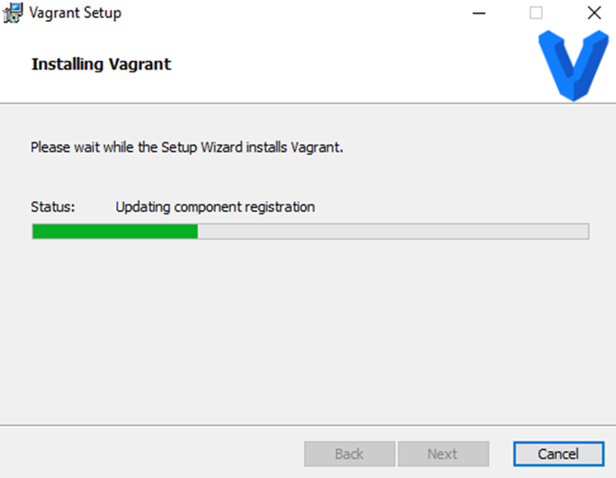
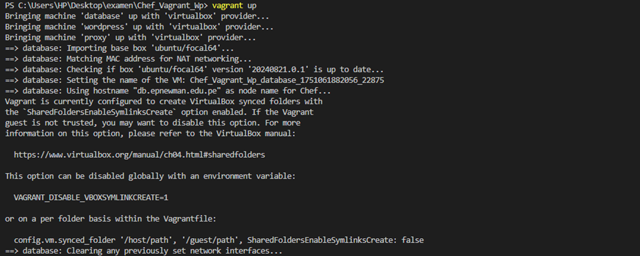
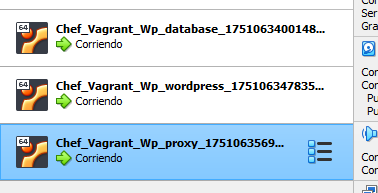
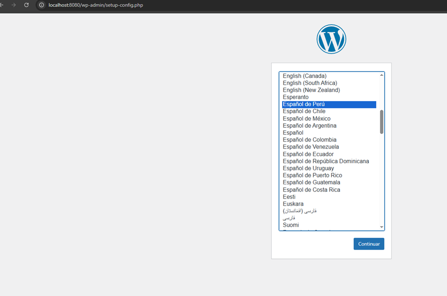
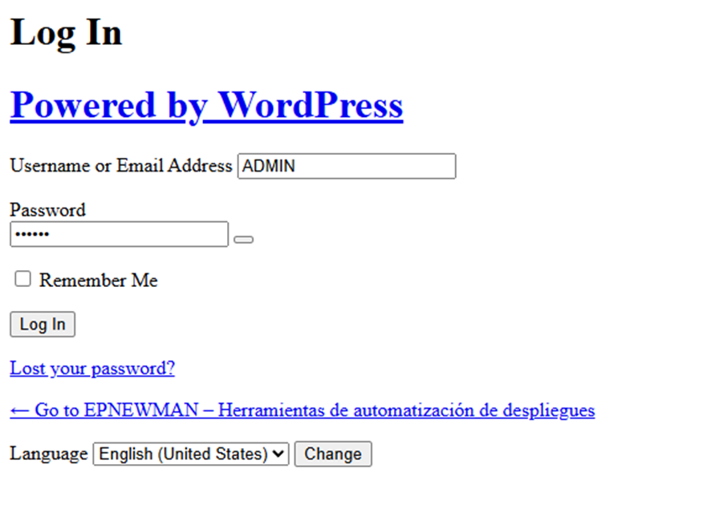
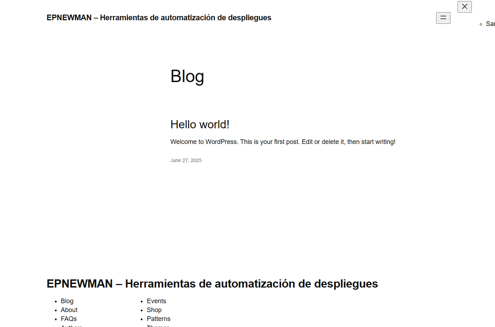

# INFORME FINAL DE AUDITORÍA DE SISTEMAS – EXAMEN PRÁCTICO

**UNIVERSIDAD PRIVADA DE TACNA**  
**FACULTAD DE INGENIERÍA – ESCUELA PROFESIONAL DE INGENIERÍA DE SISTEMAS**  
**Curso:** Auditoría de Sistemas  
**Docente:** Oscar Juan Jimenez Flores  
**Alumno:** Juan José David Pérez Vizcarra – 2019063636  
**Fecha de entrega:** 27 de junio de 2025  
**Repositorio de evidencias:** [AS_U3_EXAMEN_PRACTICO](https://github.com/tuusuario/AS_U3_EXAMEN_PRACTICO)  

---

## ENTIDAD AUDITADA

- **Nombre:** Plataforma DevIA360 – Entorno de despliegue automático con Vagrant y Chef  
- **Ubicación:** Virtual  
- **Período auditado:** 27/06/2025  
- **Equipo auditor:** Juan José David Pérez Vizcarra  

---

## ÍNDICE

1. [Resumen Ejecutivo](#1-resumen-ejecutivo)  
2. [Antecedentes](#2-antecedentes)  
3. [Objetivos de la Auditoría](#3-objetivos-de-la-auditoría)  
4. [Alcance de la Auditoría](#4-alcance-de-la-auditoría)  
5. [Normativa y Criterios de Evaluación](#5-normativa-y-criterios-de-evaluación)  
6. [Metodología y Enfoque](#6-metodología-y-enfoque)  
7. [Hallazgos y Observaciones](#7-hallazgos-y-observaciones)  
8. [Análisis de Riesgos](#8-análisis-de-riesgos)  
9. [Recomendaciones](#9-recomendaciones)  
10. [Conclusiones](#10-conclusiones)  
11. [Plan de Acción y Seguimiento](#11-plan-de-acción-y-seguimiento)  
12. [Anexos](#12-anexos)

---

## 1. RESUMEN EJECUTIVO

El presente informe detalla los resultados de la auditoría realizada al entorno de despliegue automatizado de WordPress utilizando Vagrant y Chef. La revisión tuvo como objetivo identificar vulnerabilidades en la configuración, exposición de servicios y manejo de credenciales, proponiendo medidas correctivas alineadas a buenas prácticas de DevSecOps.

---

## 2. ANTECEDENTES

El entorno auditado fue clonado del repositorio [Chef_Vagrant_Wp](https://github.com/OscarJimenezFlores/Chef_Vagrant_Wp), el cual contiene una arquitectura distribuida de tres máquinas virtuales:  
- Base de datos  
- WordPress  
- Servidor proxy  

Todas aprovisionadas mediante Chef y ejecutadas sobre VirtualBox usando Vagrant.

---

## 3. OBJETIVOS DE LA AUDITORÍA

### Objetivo General

Evaluar la implementación del entorno DevIA360 para identificar debilidades técnicas y de seguridad en el proceso de despliegue automatizado.

### Objetivos Específicos

- Verificar puertos expuestos y configuraciones de red.  
- Detectar credenciales almacenadas sin cifrado.  
- Evaluar separación de ambientes y registros de actividad.  
- Revisar configuraciones sensibles sin controles de acceso.  
- Establecer una matriz de riesgos con recomendaciones.

---

## 4. ALCANCE DE LA AUDITORÍA

Se evaluó el despliegue local mediante `vagrant up` de las siguientes VMs:

- `database` (Ubuntu 20.04 + MySQL)  
- `wordpress` (Ubuntu 20.04 + Apache + WordPress)  
- `proxy` (Ubuntu 20.04 + Nginx)  

Se analizaron los archivos `Vagrantfile`, recetas de Chef (`.rb`), y la estructura generada, además de realizar pruebas de red, acceso web y revisión del código.

---

## 5. NORMATIVA Y CRITERIOS DE EVALUACIÓN

- **COBIT 2019** – Gobernanza y gestión de TI  
- **OWASP DevSecOps Guidelines**  
- **ISO/IEC 27001** – Gestión de Seguridad de la Información  
- Buenas prácticas de automatización y despliegue

---

## 6. METODOLOGÍA Y ENFOQUE

### Fase 1: Preparación
- Clonado del entorno base  
- Revisión inicial del código fuente

### Fase 2: Ejecución y pruebas
- Despliegue con `vagrant up`  
- Inspección por SSH y pruebas de conectividad

### Fase 3: Análisis
- Revisión de configuración y servicios  
- Captura de evidencia visual  
- Evaluación de hallazgos técnicos

---

## 7. HALLAZGOS Y OBSERVACIONES

| Nº | Hallazgo | Evidencia | Grado de Criticidad |
|----|----------|-----------|----------------------|
| 1  | Uso de credenciales en texto plano (`default.rb`)  | Alto |
| 2  | Puertos expuestos sin restricciones (`Vagrantfile`)  | Medio |
| 3  | Falta de autenticación entre VMs  | Alto |
| 4  | Configuraciones sensibles sin cifrado   | Alto |
| 5  | No existe segregación de ambientes dev/prod  | Medio |

---

## 8. ANÁLISIS DE RIESGOS

| Riesgo identificado | Probabilidad (1–5) | Impacto (1–5) | Nivel de Riesgo | Control sugerido |
|---------------------|--------------------|---------------|------------------|------------------|
| Uso de credenciales sin cifrado | 5 | 5 | Crítico | Uso de variables de entorno o vaults |
| Exposición innecesaria de puertos | 4 | 4 | Alto | Definir reglas de firewall |
| Falta de registros de actividad | 4 | 3 | Alto | Implementar servicios de logging |

---

## 9. RECOMENDACIONES

- Usar vaults o variables de entorno seguras.  
- Implementar control de acceso entre VMs.  
- Añadir reglas de firewall a las VMs.  
- Automatizar validaciones de configuración con linters.  
- Separar ambientes de desarrollo y producción.

---

## 10. CONCLUSIONES

El entorno DevIA360 cumple parcialmente con las prácticas modernas de despliegue automatizado. Si bien permite levantar servicios funcionales, presenta vulnerabilidades técnicas que comprometen la seguridad. La implementación de controles adicionales es necesaria para su uso en producción.

---

## 11. PLAN DE ACCIÓN Y SEGUIMIENTO

| Hallazgo | Recomendación | Responsable | Fecha |
|----------|----------------|-------------|--------|
| 1 | Migrar credenciales a variables de entorno | Juan Pérez Vizcarra | 28/06/2025 |
| 2 | Limitar puertos y establecer reglas de firewall | Juan Pérez Vizcarra | 28/06/2025 |
| 3 | Configurar autenticación y validaciones entre VMs | Juan Pérez Vizcarra | 28/06/2025 |

---

## 12. ANEXOS

A continuación, se presentan las evidencias capturadas durante la auditoría:

- **Anexo A:** Instalación de Vagrant  
  

- **Anexo B:** Levantamiento del entorno  
  

- **Anexo C:** Máquinas virtuales corriendo correctamente  
  

- **Anexo D:** Redirección del proxy a WordPress  
  

- **Anexo E:** Pantalla de inicio de sesión en WordPress  
  

- **Anexo F:** Página principal (`index.php`) de WordPress  
  

---

## GLOSARIO DE TÉRMINOS

- **Vagrant:** Herramienta para automatizar entornos virtuales.  
- **Chef:** Sistema de gestión de configuración.  
- **Vault:** Almacén seguro para variables confidenciales.  
- **DevSecOps:** Integración de seguridad en el proceso DevOps.  
- **Forwarded Port:** Puerto redirigido del host hacia la VM.

---

**Informe elaborado por:**  
**Juan José David Pérez Vizcarra**  
**Universidad Privada de Tacna – 2025**  

---
